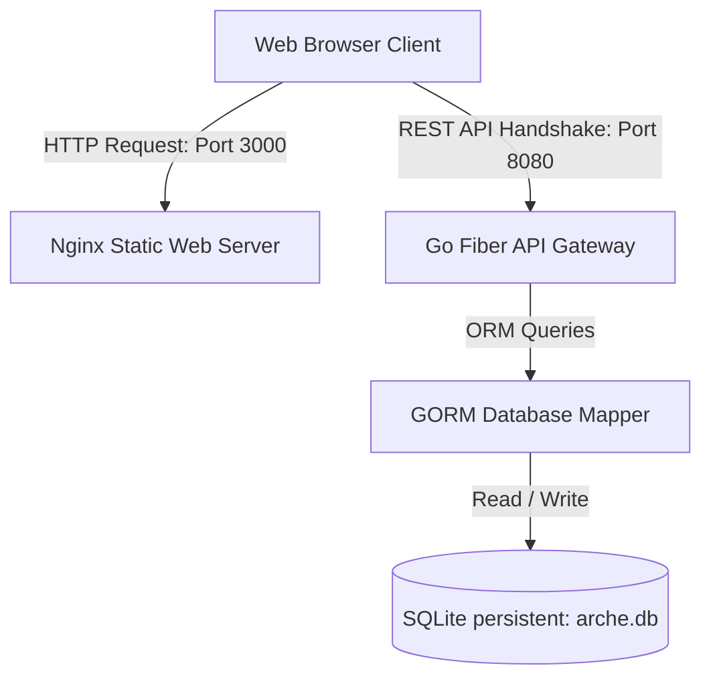

# Arche Platform Infrastructure & Architecture Guideline

Welcome to the **Arche** System Architecture Blueprint. This document serves as the formal infrastructure reference for both human developers and AI Agents to ensure that any future feature additions, migrations, or deployments align perfectly with the established technical paradigm.

---

## 🏛️ System Architecture Overview

Arche adopts a modern, decoupled **Client-Server architecture** optimized for high security, zero runtime overhead, and low system footprints:

The system separates static interface assets from dynamic business logic layers, utilizing standard Docker Compose linkages in production and a concurrent Makefile in local development.

---

## 🧮 1. Backend Infrastructure (Golang & Fiber REST API)

Located under the [backend/](file:///Volumes/staDiff/GitHub/arche/backend/) directory, the API engine is engineered with Go for maximum execution speed, low memory usage, and structural clarity:

* **Programming Language:** **Go 1.26** (utilizing native standard libraries and float precision structures).
* **API Framework:** **Fiber v2** (built on top of fasthttp for lightning-fast concurrent request routing).
* **Database Layer:** **SQLite** mapped via **GORM (Go Object Relational Mapper)**.
  * **Database File:** `backend/arche.db` (persistent).
  * **Auto-Migrations:** Configured in `backend/config/db.go` to automatically synchronize schemas on launch.
* **Authentication Paradigm:** **Stateless JSON Web Tokens (JWT)**.
  * Hashed passwords stored using **Bcrypt** (cost factor 10).
  * **JWTMiddleware:** Decodes header tokens and populates user context.
  * **AdminMiddleware:** Intercepts administrative routes to strictly restrict operations to users where `role = "admin"`.
* **Dynamic Role Onboarding:** Contains zero hardcoded administrative seeds. Upon registration, the auth handler dynamically queries GORM for the user count; the absolute first registered user is appointed as `admin`, with subsequent accounts designated as `user`.

---

## 🎨 2. Frontend Infrastructure (Next.js & Nginx)

Located under the [frontend/](file:///Volumes/staDiff/GitHub/arche/frontend/) directory, the user interface uses Next.js static rendering served on a lightweight web server:

* **Programming Framework:** **Next.js 16.2.6 (App Router)**.
* **Build Paradigm:** **Static HTML Export (`output: 'export'`)**.
  * Eliminates Node.js execution runtime in production.
  * Compiled output generated inside `frontend/out/`.
  * Dynamic dynamic-routing pages (like `/project/[id]`) implement `generateStaticParams()` exporting static parameter shell placeholders (e.g. `[{ id: "1" }]`) to pass compilation requirements successfully.
* **Production Serving Engine:** **Nginx 1.25 Alpine**.
  * Dynamic static assets are served directly from `/usr/share/nginx/html`.
  * Reverse-proxy routing configured inside [nginx.conf](file:///Volumes/staDiff/GitHub/arche/frontend/nginx.conf) to transparently redirect all API traffic (requests to `/api/*`) straight to the backend Go Docker service.
* **Translation Core:** **i18next & react-i18next** (installed client-side to prevent SSR environment conflicts, allowing users to toggle entire UI contexts dynamically).

---

## 🐳 3. Dockerization & Multi-Container Orchestration

For robust staging and deployment, the entire system is encapsulated within a cohesive **Docker Compose** structure:

* **Backend Stage Build ([backend/Dockerfile](file:///Volumes/staDiff/GitHub/arche/backend/Dockerfile)):**
  1. *Builder Stage:* Compiles the Go application using `golang:1.26-alpine` into a statically compiled single-binary build.
  2. *Runtime Stage:* Packages the binary inside a clean `alpine:3.19` runtime environment to keep the image size under **50MB**. Creates persistent directory `/app/data/` for SQLite.
* **Frontend Stage Build ([frontend/Dockerfile](file:///Volumes/staDiff/GitHub/arche/frontend/Dockerfile)):**
  1. *Builder Stage:* Installs standard node modules using `node:22-alpine` and `pnpm`, then compiles the code into static files (`pnpm run build`).
  2. *Runtime Stage:* Copies `/app/out/` directly onto `nginx:1.25-alpine`.
* **Service Orchestration ([compose.yaml](file:///Volumes/staDiff/GitHub/arche/compose.yaml)):**
  * Spins up `arche-backend` and `arche-frontend` concurrently.
  * Maps physical port `8080` for backend API routing and port `3000` for frontend web serving.
  * Maps a persistent Docker volume `sqlite_data` to `/app/data/` in the backend container to ensure database records persist across containers lifecycles.
  * Sets up local `.dockerignore` filters in both backend and frontend directories to prevent heavy `node_modules` or local `arche.db` binary states from leaking into build contexts.

---

## 🛠️ 4. Local Development Lifecycle Architecture

For rapid, non-Docker local pair-programming, developer lifecycle controls are mapped entirely inside the root [Makefile](file:///Volumes/staDiff/GitHub/arche/Makefile):

* **`make install`:** Sequentially downloads all Golang libraries and front-end dependencies (`pnpm install`).
* **`make dev`:** Launches both Go Fiber REST API and Next.js Turbopack dev server concurrently in a single terminal.
* **`make stop`:** Scans active network processes occupying ports `3000` and `8080` using `lsof -t` and gracefully terminates them.
* **`make test`:** Executes the rigorous unit testing suite (`backend/utils/sample_test.go`) validating Cochran, Slovin, Daniel, Yamane, and Lemeshow mathematics ceiling rounded assertions.
* **`make clean`:** Purges Next.js caches and deletes local `backend/arche.db` databases to reset onboarding states cleanly.
* **`make help`:** Prints a beautifully formatted, color-coded index of all targets.
