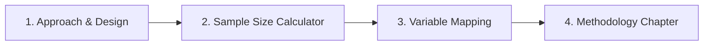

# Academic Methodology Planning Logic (methodology_planning.md)

This file sets forth the formal mathematical and logical parameters of the research methodology wizard in **Archeres**. AI Agents and developers must strictly align any updates to frontend validators, backend calculators, or local test suites with these guidelines.

---

## 🏛️ Wizard Overview & Logical Flow

The **Archeres Methodology Planner** is structured as a sequential 4-step wizard that helps researchers formulate mathematically sound and academically rigorous research designs:

---

## 📊 1. Research Approach & Design (Step 1)

Researchers select the foundational scientific paradigm and structural design of their study:

### A. Research Approaches
*   **Quantitative (`quant`):** Focuses on numerical measurements, statistical hypothesis testing, and deductive reasoning.
*   **Qualitative (`qual`):** Focuses on human experience, interviews, narrative patterns, and inductive analysis.
*   **Mixed Methods (`mixed`):** Combines quantitative precision with qualitative depth for multi-layered research problems.

### B. Research Designs / Types
A selector mapped to popular academic research design types including:
*   *Experimental* (True Experimental)
*   *Quasi-Experimental*
*   *Survey Research*
*   *Descriptive Studies*
*   *Case Study*
*   *Grounded Theory*
*   *Action Research*
*   *Exploratory Sequential* (Mixed)
*   *Explanatory Sequential* (Mixed)

---

## 🧮 2. Sample Size Calculations & Mathematics (Step 2)

Calculations are executed client-side in browser JS (`WorkspaceClient.tsx`) for real-time responsiveness, and validated server-side in Go (`backend/utils/sample.go`) during testing.

### Key Parameter Mappings:
*   **Population Size ($N$):** Finite count of target population.
*   **Margin of Error ($e$ or $d$):** Represented as a float (e.g., $5\% = 0.05$).
*   **Confidence Level ($1-\alpha$):** Determines the standard normal distribution $Z$-score:
    *   $90\%$ Confidence $\rightarrow Z = 1.645$
    *   $95\%$ Confidence $\rightarrow Z = 1.96$
    *   $99\%$ Confidence $\rightarrow Z = 2.576$
*   **Estimated Proportion ($p$):** Assumed prevalence of the attribute (defaults to $0.5$ / $50\%$ to guarantee maximum variance and maximum conservative sample size).

---

### Mathematical Equations

#### 1. Slovin Formula (Yamane Formula)
Used for finite populations when proportion is unknown:
$$n = \frac{N}{1 + N \cdot e^2}$$

#### 2. Cochran Formula (Infinite Populations)
Used when the target population size is unknown or extremely large:
$$n_0 = \frac{Z^2 \cdot p \cdot (1 - p)}{e^2}$$

#### 3. Lemeshow Formula (WHO Standard)
Used for finite population correction on estimated proportions:
$$n = \frac{n_0}{1 + \frac{n_0 - 1}{N}}$$
*(Where $n_0$ is calculated using the Cochran infinite population formula).*

#### 4. Krejcie & Morgan Formula (1970 Table Standard)
Directly maps population bounds onto representative samples:
$$s = \frac{\chi^2 \cdot N \cdot P \cdot (1 - P)}{d^2 \cdot (N - 1) + \chi^2 \cdot P \cdot (1 - P)}$$
*   $\chi^2$ (Chi-square for 1 degree of freedom): $3.841$ (for 95% Confidence) or $6.635$ (for 99% Confidence).
*   $P$ (Population proportion): Default $0.5$ for maximum sample size.
*   $d$ (Margin of error): Expressed as a decimal (e.g., $0.05$).

#### 5. Daniel Formula
Used for biostatistics random sampling of proportions. Mapped mathematically to the Lemeshow / Cochran corrections.

#### 6. Isaac & Michael Formula
Uses Chi-Square distributions to estimate sample sizes based on fixed error rates (1%, 5%, 10%).

#### 7. Suharsimi Arikunto Guideline (Rule of Thumb)
A heuristic for Indonesian educational research:
* If $N < 100$, sample the entire population ($n = N$).
* If $N \ge 100$, sample between $10\%$ to $25\%$ of the population.

#### 8. Gay & Diehl Guideline
Recommends sample size based on the methodology design itself rather than statistical power:
* **Descriptive / Survey:** $10\%$ to $20\%$ of the population.
* **Correlational:** Minimum $30$ subjects.
* **Experimental / Causal-Comparative:** Minimum $60$ subjects.

#### 9. Kish Leslie Formula
Used for cross-sectional studies on unknown or infinite populations to estimate proportions with a defined precision margin ($e$).

---

### Core Computation Rules:
1.  **Scientific Ceiling Rounding:** The calculated sample size ($n$) must always be rounded up to the nearest whole integer using a ceiling function (`Math.ceil` in JS / `math.Ceil` in Go) to guarantee that the statistical threshold is fully satisfied.
2.  **Boundary Checks:** 
    *   If the calculated $n > N$, cap $n$ at $N$.
    *   If the calculated $n < 1$, default $n$ to $1$.
    *   If $N \le 0$ or $e \le 0$, return $0$.

### 📊 3. Interactive Sampling Power & Sensitivity Visualizer
To help researchers visualize statistical trade-offs, the platform generates a client-side dynamic **SVG Sensitivity Curve**:
*   **X-Axis:** Margin of Error ($e$) ranging continuously from $1\%$ ($0.01$) to $15\%$ ($0.15$).
*   **Y-Axis:** Minimal sample size ($n$) calculated using the selected formula (e.g. Slovin, Cochran, Lemeshow).
*   **Interactivity:** Hovering over the neon curve displays a dynamic tooltip showing the exact coordinates ($e$, $n$), letting users easily evaluate how choosing a tighter margin of error affects their minimum sample requirements.

---

## ⛓️ 3. Variable Mapping & Scales (Step 3)

The variable mapping allows researchers to define the structural indicators of their conceptual framework using two main parameters:

### A. Methodological Roles
*   **Independent (Cause):** Stimulus variable that is manipulated or categorized.
*   **Dependent (Effect):** Response variable measured to assess outcome.
*   **Mediator (Mechanism):** Variable that explains the relationship between cause and effect.
*   **Moderator (Context):** Variable that alters the direction or strength of the relationship.

### B. Statistical Measurement Scales (Stevens' Taxonomy)
*   **Nominal:** Categorical classification without rank or mathematical order (e.g., gender, occupation).
*   **Ordinal:** Categorical classification with a natural ranking, but unequal distances between ranks (e.g., Likert scale, education level).
*   **Interval:** Numeric scale with ordered, equal intervals, but no true absolute zero (e.g., temperature, IQ score).
*   **Ratio:** Numeric scale with equal intervals and a true absolute zero point supporting scalar multiplication (e.g., income, weight, age).

### 🔒 C. Zero-Knowledge Psychometric Reliability Planner (E2EE)
For quantitative instrument validation, researchers can plan and simulate pilot pre-tests locally under a collapsible premium **🔒 Instrument Reliability Planner (E2EE)** panel:
*   **Privacy Mandate:** Response response grids ($N \times k$) are strictly computed and held client-side in RAM-only React state. No individual cell values or test scores are ever sent to backend APIs or databases.
*   **Dynamic Response Grid:** Syncs to an $N \times k$ responsive matrix where $N$ represents pilot respondents (clamped $5 \le N \le 100$) and $k$ represents questionnaire items (clamped $2 \le k \le 100$).
*   **Reliability Algorithms:**
    1.  **Cronbach's Alpha (Continuous / Likert Scale):**
        $$\alpha = \frac{k}{k - 1} \left( 1 - \frac{\sum_{i=1}^k s_i^2}{s_t^2} \right)$$
        *Where $s_i^2$ is the variance of item $i$, and $s_t^2$ is the variance of total scores across respondents.*
    2.  **Kuder-Richardson 20 / KR-20 (Dichotomous / Binary Choice):**
        $$KR_{20} = \frac{k}{k - 1} \left( 1 - \frac{\sum_{i=1}^k p_i q_i}{s_t^2} \right)$$
        *Where $p_i$ is the correct/positive response proportion of item $i$, $q_i = 1 - p_i$ is the incorrect/negative proportion, and $s_t^2$ is total score variance.*
*   **Academic Threshold:** Leverages the **Nunnally Standard (1978)** where $\alpha \ge 0.70$ designates a highly reliable and cohesive academic instrument. If reliability drops below $0.70$, the UI displays a warnings banner prompting question redesign.
*   **Boundary Cases:** If item variance is zero ($s_t^2 = 0$) or items count $k \le 1$, the calculations gracefully handle undefined states by mapping to `error_variance` indicators instead of throwing runtime exceptions.

---

## 🔀 4. Smart Statistical Advisor & Code Generator (Step 3)

Based on Stevens' measurement scales, the planner implements an **automated statistical routing engine** to suggest appropriate hypothesis-testing methods. It provides a tabbed interactive advisor interface that generates copy-pasteable statistical script templates in **Python (SciPy)** and **Go**:

| Mapped Variable Scales | Recommended Statistical Instrument | Explanation |
| :--- | :--- | :--- |
| **Contains Nominal & Ratio/Interval** | `Independent T-Test / ANOVA` | Used to compare numerical means across categorical groupings. |
| **Contains Only Ratio & Interval** | `Multiple Linear Regression / Pearson Correlation` | Used to test continuous linear relationships and predictive powers. |
| **Contains Only Nominal** | `Chi-Square Test of Independence` | Used to analyze association frequency counts between categorical variables. |
| **Contains Ordinal or Mixed Other** | `Spearman Rank Correlation / Chi-Square` | Non-parametric methods to analyze ranked relationships or associations. |

---

## 📁 5. Methodology Chapter Compiler (Step 4)

Step 4 compiles all parameters entered into a structured, replication-ready **Chapter III (Metodologi Penelitian)** thesis draft.

### A. Draft Outline
The generated draft contains five core academic sections:
1.  **3.1 Research Approach and Design (Pendekatan dan Desain Penelitian):** States the paradigm, reasoning logic, and chosen design type.
2.  **3.2 Population and Sampling (Populasi dan Sampel):** Outlines the target population size, configured confidence levels, margin of error, specific mathematical formula used, and final ceiling-rounded minimal sample size.
3.  **3.3 Research Variables and Measurement Scales (Variabel dan Indikator Penelitian):** Displays a clean markdown GFM table matching the mapped variables matrix, detailing names, roles, and Stevens' scale types.
4.  **3.4 Data Analysis Plan (Rencana Analisis Data):** Proposes the specific statistical tools generated by the routing engine, complete with the **Smart Advisor academic justification block**.
5.  **3.5 Instrument Validity and Reliability (Validitas dan Reliabilitas Instrumen):** Appends the psychometric pre-test pilot methodology, detailing the pilot sample size ($N$), item count ($k$), exact computed coefficient ($\alpha$ or $KR_{20}$), and the Nunnally reliability benchmark.

### B. Export Paradigms
*   **Bilingual Generation:** Automatically formats the draft in both **Indonesian** and **English** depending on active preview selections.
*   **Standard Markdown Syntax:** Outputs clean markdown (`.md`) supporting standard heading weights (`#`, `##`), LaTeX equations, and standard GFM tables. Allows seamless copying and instant conversion into Microsoft Word, Google Docs, Obsidian, or Notion.
