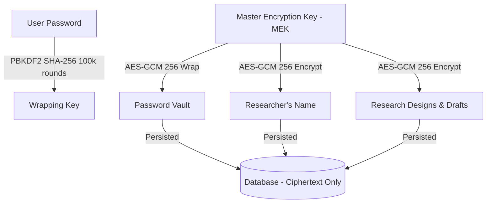

<p align="center">
  
</p>

<h1 align="center">Archeres</h1>

<p align="center">
  
  
  
  
  
  
  
</p>

**Archeres** is a state-of-the-art, scholarly, and Zero-Knowledge End-to-End Encrypted (E2EE) Scientific Research Methodology Planner. Designed for academic scholars and students, Archeres provides an interactive, mathematically rigorous environment to operationalize study variables, evaluate sample sizes, and instantly compile peer-review-ready Chapter III thesis methodology drafts concurrently in English and Indonesian.

---

## 🏛️ Core Pillars & Capabilities

1. **High-Precision Estimators & Sensitivity Curve**: Precise sample sizes powered by Go backend estimators (**Slovin**, **Lemeshow**, **Cochran**, **Yamane**, **Daniel**, **Isaac & Michael**, **Arikunto**, **Gay & Diehl**, and **Kish Leslie** formulas) and a dynamic neon **SVG Sensitivity Curve Visualizer** mapping margin of error $e$ to sample size $n$.
2. **Multi-Paradigm Step 3 Workspace**:
   * *Quantitative Survey*: Local E2EE calculator for pre-test pilot reliability using **Cronbach's Alpha** (Likert scales) and **KR-20** (binary choices) under the **Nunnally Standard (1978)**.
   * *Secondary & Lab Data*: Integrated data quality assurance methodological guidance for non-kuesioner quantitative studies.
   * *Qualitative Research*: Active **Lincoln & Guba (1985)** trustworthiness framework checklist covering Data Triangulation, Member Checking, Audit Trail, and Referential Adequacy.
3. **Stevens' Scale Variable Operationalization**: Operationalize variables into Nominal, Ordinal, Interval, or Ratio scales to unlock the **Smart Statistical Advisor** which recommends appropriate tests and generates copy-pasteable scripts in **Python (SciPy)** and **Go**.
4. **Scholarly Pedagogy**: Stevens' taxonomy definitions, formula derivations, and standard guidelines integrated directly into the workspace.
5. **Unified Sidebar Backup**: Sandboxed, zero-knowledge offline JSON workspace backups (fully portable and E2EE isolated) accessible globally across any step in the sidebar.
6. **Dynamic Chapter III Compiler**: Instantly compiles structured Chapter III Bab 3 markdown drafts adapting dynamically to your paradigm (psychometric surveys vs. secondary data integrity vs. Lincoln & Guba strategies) in English and Indonesian concurrently.
7. **Anti-Spam & Security Hardening**: Built-in distorted cryptographic SVG math captcha, Fiber-level authentication rate limiters (10 req/min/IP), SQLite WAL production database tuning, and Nginx premium security headers (CSP, HSTS).

---

## 🔒 Zero-Knowledge Cryptographic Protocol Map

Archeres implements a client-side cryptographic protocol using the native Web Crypto API. Plaintext intellectual property and user identity never touch the database, remaining 100% inaccessible to server administrators or database breaches.



1. **Key Derivation (KDF)**: Derives a 256-bit **Password Wrapping Key** locally using PBKDF2 (SHA-256, 100,000 rounds) and a server-provided salt.
2. **Master Encryption Key (MEK)**: A high-entropy 256-bit AES-GCM client-side key that encrypts all profile data, variables, parameters, and compiled Bab III drafts.
3. **Vault Wrapping**: The MEK is wrapped with the Password Wrapping Key using AES-GCM 256 and sent to the server for cloud-synced E2EE storage.
4. **Name Masking**: Full names are encrypted client-side. Server-side log audits mask all identities as **"Encrypted User (E2EE)"**.
5. **RAM-Only Policy**: Raw psychometric test response matrices are processed strictly in transient client-side state and never sent to any server.

---

## 🛠️ Local Development Setup

Archeres is structured as a monorepo consisting of a **Next.js App Router** frontend (`/web`) and a **Go (Fiber)** backend (`/backend`).

### Prerequisites
* Go `1.21+`
* Node.js `18+` (with `pnpm`)
* GCC/Make

### Essential Commands
```bash
# 1. Install all monorepo dependencies
make install

# 2. Run Go backend and Next.js frontend concurrently in dev mode
make dev

# 3. Execute all mathematical precision unit tests
make test

# 4. Stop all local processes occupying ports 3000 and 8080
make stop
```

---

## 🚀 Production Deployment (Docker Compose)

Create a `compose.yaml` in your server directory:

```yaml
name: archeres

services:
  backend:
    image: repo.alexmaisa.my.id/alexmaisa/archeres-backend:latest
    container_name: archeres-backend
    ports:
      - "8080:8080"
    environment:
      - PORT=8080
      - DATABASE_PATH=/app/data/archeres.db
      - JWT_SECRET=your_production_jwt_secret_here
      - SMTP_HOST=smtp.yourprovider.com
      - SMTP_PORT=587
      - SMTP_USER=notifications@yourdomain.com
      - SMTP_PASS=your_smtp_password
      - SMTP_FROM=notifications@yourdomain.com
      - APP_URL=https://archeres.yourdomain.com
    volumes:
      - archeres-db:/app/data
    restart: unless-stopped

  web:
    image: repo.alexmaisa.my.id/alexmaisa/archeres-web:latest
    container_name: archeres-web
    ports:
      - "3000:3000"
    depends_on:
      - backend
    restart: unless-stopped

volumes:
  archeres-db:
    name: archeres-db-volume
```

Run the stack:
```bash
docker compose up -d
```

---

## 🔄 CI/CD & Automated Publishing

A Forgejo Actions pipeline (`.forgejo/workflows/docker-publish.yml`) automatically builds, packages, and publishes multi-architecture production Docker images to our private registry (`repo.alexmaisa.my.id`) upon every GitHub release event, tagging them with the release version and `latest`.

---

## ⚖️ License & Auditability

This project is source-available and licensed under the **PolyForm Noncommercial License 1.0.0**. The source code of both the Next.js client and Go server is fully accessible for cryptographic audits and academic methodology validation. Free for educational, personal, and research purposes, but strictly prohibits commercial exploitation or SaaS monetization without prior written authorization from **Benny Maisa**.
