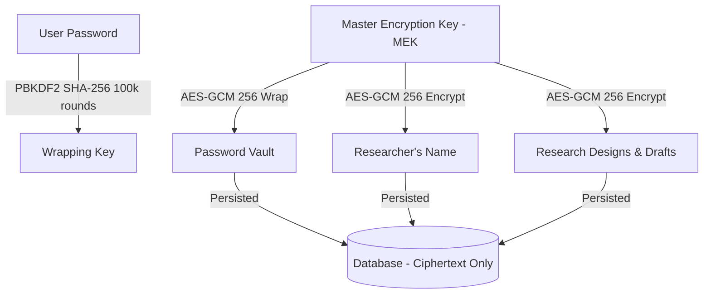

<p align="center">
  
</p>

<h1 align="center">Archeres</h1>

<p align="center">
  
  
  
  
</p>
<p align="center">
  
  
  
</p>

**Archeres** is a state-of-the-art, scholarly, and Zero-Knowledge End-to-End Encrypted (E2EE) Scientific Research Methodology Planner. Designed specifically for academic scholars, researchers, and university students, Archeres provides an interactive, mathematically rigorous environment to operationalize study variables, calculate scientifically sound sample sizes, and instantly compile peer-review-ready Chapter III thesis methodology drafts concurrently in English and Indonesian.

---

## 🏛️ Core Pillars & Capabilities

1. **Validated Mathematical Estimators**: High-precision, peer-reviewed sample size calculations powered by a high-speed Go backend. Instantly calculate sample sizes using **Slovin**, **Lemeshow**, **Cochran**, and **Yamane** formulas with strict float precision and ceiling rounding assertions.
2. **Stevens' Scale Variable Operationalization**: Operationalize variables into Nominal, Ordinal, Interval, or Ratio measurement scales. Systematically map conceptual indicators to unlock context-aware statistical analysis advice and recommendations.
3. **Scholarly Pedagogy Module**: Learn as you build. Interactive Stevens' scale guides, Stevens' taxonomy definitions, and formula derivations are seamlessly integrated into every step of the research workspace.
4. **Structured Chapter III Compiler**: Instantly generate structured Chapter 3 methodology markdown files dynamically formatted in academic Bahasa Indonesia and English concurrently.

---

## 🔒 Zero-Knowledge E2EE Cryptographic Architecture Audit Map

Archeres implements a rigorous **Zero-Knowledge client-side cryptographic protocol** using the browser's native Web Crypto API. Plaintext intellectual property and researcher identity data never leave your local machine, rendering data completely inaccessible to server administrators, database leaks, or third-party eavesdroppers.

### 🔑 Cryptographic Flow & Auditing Specifications



1. **Key Derivation (KDF)**:
   * During registration, the user's password is combined with a cryptographically secure server-provided `Vault Salt` and put through **PBKDF2** (SHA-256, 100,000 rounds) to derive a 256-bit **Password Wrapping Key** on the client side.
2. **Master Encryption Key (MEK)**:
   * A unique, high-entropy 256-bit **Master Encryption Key (MEK)** is randomly generated on the client side during sign-up. 
   * This MEK is the root key used for all AES-GCM 256 data encryptions.
3. **Vault Wrapping**:
   * The MEK is wrapped (encrypted) with the derived Password Wrapping Key using AES-GCM 256. The resulting ciphertext is sent to the server as `passwordVault` along with a recovery-key vault `recoveryVault`.
4. **Researcher Profile & Name E2EE**:
   * The researcher's full name is encrypted on the client side using the MEK prior to transmission. 
   * When administrators view audit logs or dashboard lookups, names are automatically masked as **"Encrypted User (E2EE)"** or **"Pengguna Terenkripsi (E2EE)"** based on the chosen language.
5. **Research Design E2EE**:
   * Project titles, variable definitions, sample formulas, parameters, and compiled drafts are encrypted locally using the MEK prior to API transmission. The database stores strictly ciphertext.

---

## 🛠️ Local Development Setup

Archeres is structured as a monorepo consisting of a **Next.js App Router** frontend (`/web`) and a **Go (Fiber)** backend (`/backend`).

### Prerequisites
* Go `1.21+`
* Node.js `18+` (with `pnpm` package manager)
* GCC/Make tools

### Makefile Helper Commands
A comprehensive `Makefile` is located in the repository root to automate common tasks:

```bash
# 1. Install all backend (Go) and frontend (pnpm) dependencies
make install

# 2. Run both Go backend and Next.js frontend concurrently in dev mode
make dev

# 3. Start only the Go backend server (port 8080)
make run-backend

# 4. Start only the Next.js development server (port 3000)
make run-web

# 5. Execute all mathematical precision unit tests
make test

# 6. Stop all local processes occupying ports 3000 and 8080
make stop

# 7. Clean up build caches, local temporary databases, and NextJS folders
make clean
```

---

## 🚀 Production Deployment (Docker Compose)

Archeres is fully production-ready and optimized to be deployed via Docker. Production containers are designed with non-root privileges, slim Alpine base images, and secure environment isolation.

### 1. Pre-built Registry Deployment (Recommended)
Our CI/CD pipeline builds and publishes hardened, production-ready images to the container registry on every official release.

Create a `compose.yaml` in your server directory:

```yaml
name: archeres

services:
  backend:
    image: repo.alexmaisa.my.id/alexmaisa/archeres-backend:latest
    container_name: archeres-backend
    ports:
      - "8080:8080"
    environment:
      - PORT=8080
      - DATABASE_PATH=/app/data/archeres.db
      - JWT_SECRET=your_production_jwt_secret_here
      - SMTP_HOST=smtp.yourprovider.com
      - SMTP_PORT=587
      - SMTP_USER=notifications@yourdomain.com
      - SMTP_PASS=your_smtp_password
      - SMTP_FROM=notifications@yourdomain.com
      - APP_URL=https://archeres.yourdomain.com
    volumes:
      - archeres-db:/app/data
    restart: unless-stopped

  web:
    image: repo.alexmaisa.my.id/alexmaisa/archeres-web:latest
    container_name: archeres-web
    ports:
      - "3000:3000"
    depends_on:
      - backend
    restart: unless-stopped

volumes:
  archeres-db:
    name: archeres-db-volume
```

Run the stack in detached mode:
```bash
docker compose up -d
```

### 2. Local Production Build
If you prefer to build the production Docker images directly from source on your local machine, use `compose.build.yaml`:

```bash
# Build the production images locally
docker compose -f compose.build.yaml build

# Launch the locally built production stack
docker compose -f compose.build.yaml up -d
```

---

## 🔄 CI/CD & Automated Publishing (Forgejo Actions)

The repository integrates a robust **Forgejo Actions** workflow located in `.forgejo/workflows/docker-publish.yml`. 

On every Git release event (`release: [published]`), the workflow automatically:
1. Checks out the codebase.
2. Configures QEMU and Docker Buildx.
3. Authenticates securely with our Docker container registry (`repo.alexmaisa.my.id`).
4. Compiles, packages, and pushes high-performance, multi-arch Docker images for both `archeres-backend` and `archeres-web`, tagging them with the release tag name and `latest`.

---

## ⚖️ License & Auditability

This project is open-source and licensed under the **MIT License**. The complete source code of both the Next.js client and Go server is fully accessible to encourage public cryptographic audits, security reviews, and academic methodology validation. See the [LICENSE](LICENSE) file for details.
